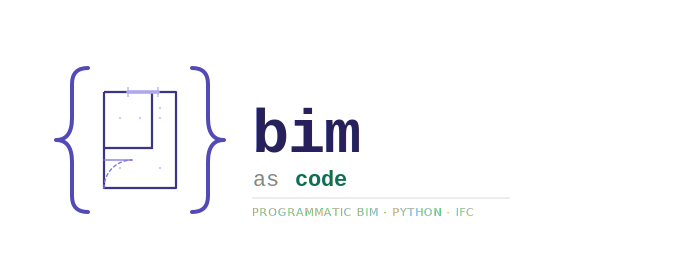
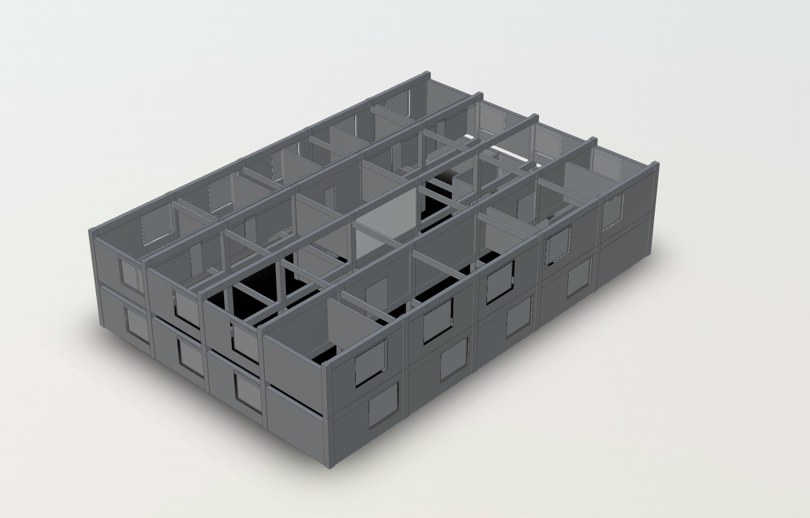
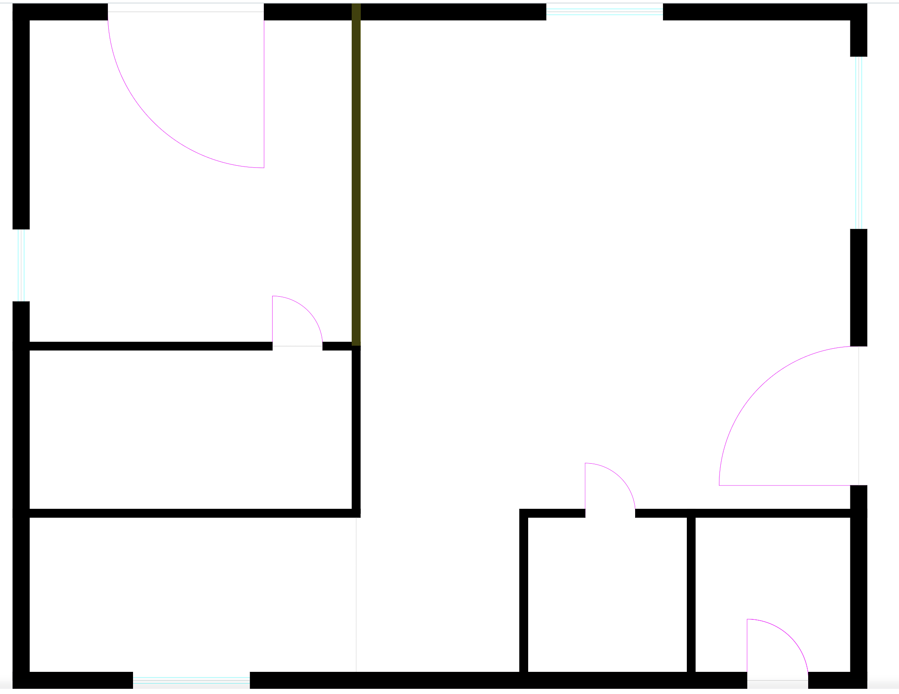
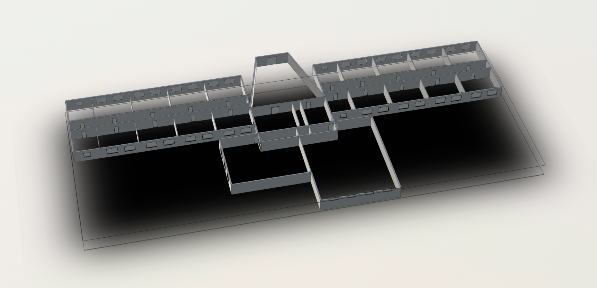
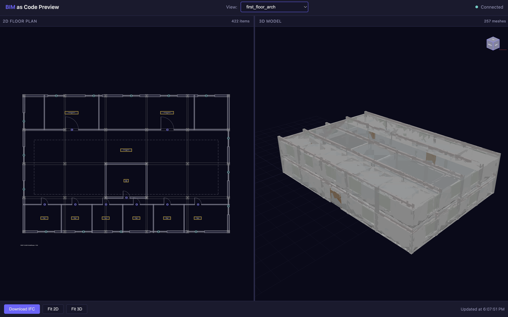

<p align="center">
  
</p>

<p align="center">
  <strong>Programmatic Building Information Modeling in Python</strong>
</p>

---

**BIM as Code** is a Python library for programmatic Building Information Modeling. Write Python code to create buildings, generate documentation drawings, and export to industry-standard formats like IFC and DXF.

## Quick Example

```python
from bimascode.spatial.building import Building
from bimascode.spatial.level import Level
from bimascode.architecture import Wall, create_basic_wall_type, Door, DoorType, Window, WindowType
from bimascode.utils.materials import MaterialLibrary

# Create building and level
building = Building("My Building")
ground = Level(building, "Ground Floor", elevation=0)

# Define types
concrete = MaterialLibrary.concrete()
wall_type = create_basic_wall_type("Exterior Wall", 300, concrete)
door_type = DoorType(name="Entry Door", width=900, height=2100)
window_type = WindowType(name="Standard Window", width=1200, height=1500, default_sill_height=900)

# Create walls (10m x 8m building)
wall_south = Wall(wall_type, (0, 0), (10000, 0), ground)
wall_east = Wall(wall_type, (10000, 0), (10000, 8000), ground)
wall_north = Wall(wall_type, (10000, 8000), (0, 8000), ground)
wall_west = Wall(wall_type, (0, 8000), (0, 0), ground)

# Add door and window
door = Door(door_type, wall_south, offset=2000)
window = Window(window_type, wall_east, offset=3000)

# Export to IFC
building.export_ifc("my_building.ifc")
```

## Features

### Spatial Organization
- **Buildings** - Root container with unit system (metric/imperial)
- **Levels** - Building storeys with elevation tracking
- **Grids** - Architectural layout axes
- **Rooms** - Spatial elements with area/volume calculations

### Architectural Elements
- **Walls** - Straight walls with compound layer stacks
- **Wall Joins** - Automatic corner, T-junction, and cross detection
- **Doors** - Hosted in walls with configurable types
- **Windows** - Hosted in walls with sill height control
- **Floors/Slabs** - Horizontal elements with layer stacks
- **Roofs** - Flat roofs with drainage slope
- **Ceilings** - Suspended ceiling elements
- **Openings** - Voids in floors/roofs (stairs, shafts, skylights)

### Structural Elements
- **Columns** - Vertical structural members with section profiles
- **Beams** - Horizontal/sloped members spanning between points

### Drawing Generation
- **Floor Plans** - Horizontal section cuts with configurable cut height
- **Elevations** - Exterior projections with hidden line removal
- **Sections** - Vertical section cuts with depth control
- **View Templates** - Visibility and graphic overrides per element category
- **Line Weights** - AIA/NCS standard line weights (0.13mm to 0.70mm)
- **DXF Export** - Professional CAD output with proper layers
- **PDF Export** - High-quality vector PDF output for printing and review

### Performance
- **Spatial Indexing** - R-tree for fast element queries
- **Representation Caching** - Cached 2D linework with automatic invalidation

### Export Formats
- **IFC4/IFC2x3** - Full project hierarchy, properties, and materials
- **DXF** - AIA-compliant layers and line weights
- **PDF** - Vector graphics for printing and client distribution

## Installation

```bash
pip install bimascode
```

For development:

```bash
git clone https://github.com/benjaminwfriedman/bimascode.git
cd bimascode
pip install -e ".[dev,viz]"
```

## Requirements

- Python 3.10+
- [build123d](https://github.com/gumyr/build123d) - Geometry engine
- [IfcOpenShell](https://ifcopenshell.org/) - IFC support
- [ezdxf](https://ezdxf.mozman.at/) - DXF export
- [matplotlib](https://matplotlib.org/) - PDF export

## Examples

The library includes complete example scripts demonstrating real-world building scenarios. Each generates IFC models for 3D viewing, DXF floor plans for CAD, and PDF sheets for printing.

### Office Building

A 2-floor commercial building (30m x 20m) with:
- Ground floor: Reception, 4 meeting rooms, open workspace
- First floor: 6 private offices, 2 conference rooms
- Central elevator/stair core
- Steel structural grid (6m x 5m) with columns and beams
- Architectural and structural view templates with differentiated line weights

```bash
python examples/example_office_building.py
```

<p align="center">
  
</p>

### Residential Home

A 2-floor family home (15m x 12m) with:
- Ground floor: Living room, dining room, kitchen, powder room, 2-car garage
- Upper floor: Master suite with ensuite, 2 bedrooms, shared bathroom, laundry
- Picture windows, sliding doors, varied window types
- North-south and east-west building sections

```bash
python examples/example_residential_home.py
```

<p align="center">
  
</p>

### School Building

A single-story H-shaped elementary school (~90m x 45m) with:
- East and west classroom wings (8 classrooms each)
- Central lobby with diagonal entry walls
- Admin offices and library
- Gymnasium (18m x 24m) and cafeteria (18m x 15m)
- Boys and girls restrooms in each wing
- Automatic wall join processing for complex intersections

```bash
python examples/example_school_building.py
```

<p align="center">
  
</p>

### All Examples

| Example | Description | Output |
|---------|-------------|--------|
| `example_hospital_wing.py` | Hospital wing with patient rooms | IFC + DXF sheet + PDF sheet |
| `example_office_building.py` | Commercial office with structural grid | IFC + 4 DXF plans + 2 sections |
| `example_residential_home.py` | 2-story family home | IFC + 2 DXF plans + 2 sections |
| `example_school_building.py` | H-shaped elementary school | IFC + DXF floor plan |
| `sprint6_demo.py` | Simple house tutorial | IFC + DXF |
| `school_floor_plan.py` | Alternative school layout | IFC + DXF |
| `office_world_geometry_demo.py` | Office with view templates | IFC + DXF |

## Preview Server

BIM as Code includes a live-reload preview server for interactive development. Run any example script and see changes instantly in your browser with synchronized 2D floor plans and 3D model views.

```bash
bimascode serve examples/example_office_building.py
```

This starts a local server at `http://localhost:8766` with:
- **2D Floor Plan** - Interactive pan/zoom with element highlighting
- **3D Model** - Orbit controls, element selection, wireframe toggle
- **Live Reload** - Automatic refresh when you save your script
- **View Selector** - Switch between floor levels
- **Export** - Download IFC, fit views to content

<p align="center">
  
</p>

The preview server watches your Python file for changes. Edit your building code, save, and the browser automatically reloads with the updated model.

## Documentation

See the [docs/](./docs) directory for detailed documentation.

## Project Structure

```
bimascode/
├── src/bimascode/
│   ├── core/           # Base Element class, type/instance pattern
│   ├── spatial/        # Building, Level, Grid, Room
│   ├── architecture/   # Wall, Floor, Roof, Door, Window, Ceiling
│   ├── structure/      # Column, Beam, Profile
│   ├── drawing/        # Floor plans, elevations, sections, DXF/PDF export
│   ├── performance/    # Spatial index, representation cache
│   ├── export/         # IFC exporter/importer
│   └── utils/          # Units, Materials
├── examples/
├── tests/
└── docs/
```

## License

MIT

## Credits

Built with:
- [build123d](https://github.com/gumyr/build123d) - Pythonic CAD library
- [IfcOpenShell](https://ifcopenshell.org/) - IFC toolkit
- [ezdxf](https://ezdxf.mozman.at/) - DXF library
- [OCP CAD Viewer](https://github.com/bernhard-42/vscode-ocp-cad-viewer) - 3D visualization
